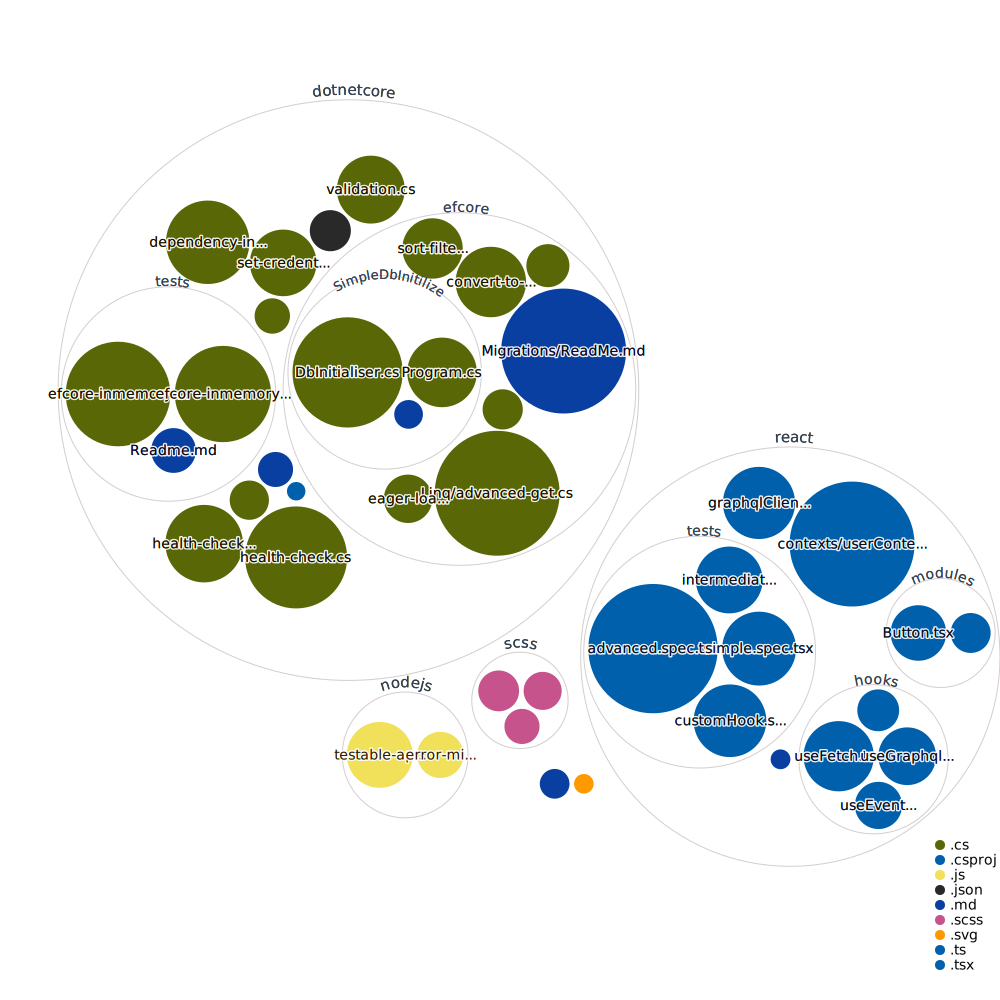

# developer-essentials

This is a common repository which have commonly used code gists available.

## Common Links
- https://www.freecodecamp.org/news/what-is-a-full-stack-developer-full-stack-engineer-guide/

### Visualisation

https://octo-repo-visualization.vercel.app/?repo=janitha000%2Fdeveloper-essentials

